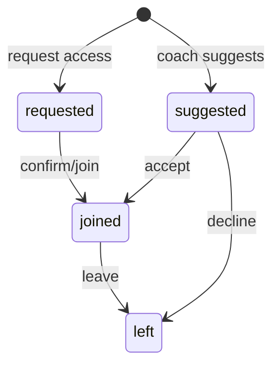

# noa2 — GRPD Execution Plan v1 (Session‑first, session‑scoped groups)

This document is an **executable implementation plan** (feature-by-feature) derived from the repo’s current code and the clarified doctrine:

- **Session is the container**
- **Pace groups are session‑scoped only**
- **Profile has no group identity**

Repo anchors (current implementation):
- Mobile/Expo screens live under `app/*` (Expo Router).
- Client persistence is AsyncStorage in `lib/*Store.ts`.
- API client is `lib/api/*` with optional mock (`lib/api/mock.ts`) when `EXPO_PUBLIC_API_URL` is empty.
- Next.js API routes are in `app/api/v1/*/route.ts`.
- Prisma schema is `prisma/schema.prisma` + migrations in `prisma/migrations/*`.

---

## A) Doctrine (final) — 1‑page Session‑first tree

### L1: **Session** (the container)
- **L2: Properties (canonical)**
  - Identity: `id`
  - Scheduling: `dateISO`, `timeMinutes`, `dateLabel`
  - Location: `spot`, `meetingPoint`
  - Workout definition: `typeLabel`, `workoutId`, session-scoped group config
  - Visibility: `visibility: "public" | "members"`, **`clubId` (required when members)**  
  - Host/coach: `hostUserId`, optional display fields `coachName`, `coachPhone`, `coachAdvice`
  - Participants + grouping:
    - session participation is **Attendance** records
    - group membership is `attendance.groupId` only (A/B/C/D; nullable)
- **L3: Key flows**
  - Create session (public or club)
  - Join (runner confirms) / Leave
  - Request access (non-member to members-only session)
  - Coach suggests group (not join)
- **L4: Visibility/permissions**
  - `visibility=public`: anyone can view/join
  - `visibility=members`: **must have `clubId`**; view/join gated by club membership
  - Coach/admin actions gated by club role

_Current code references_:
- Client session model: `lib/sessionData.ts` `SessionData`
- Server session model: `prisma/schema.prisma` `Session`, API routes `app/api/v1/sessions/*`
- Session screens: `app/(tabs)/index.tsx`, `app/session/[id].tsx`, `app/session/create.tsx`

---

### L1: **Runner**
- **L2: Properties**
  - Identity: `name` / `firstName` (`lib/profileStore.ts` `RunnerProfile`)
  - Ability signals: `ReferencePaces`, `TestRecord`
  - Account auth tokens: `lib/authStore.ts`
- **L3: Key flows**
  - Edit profile + PRs (local)
  - Optional PR sharing to club membership
- **L4: Visibility/permissions**
  - No group identity in profile (no “Group A/B/C/D” or “Groupe D” as identity)

_Current code references_:
- `lib/profileStore.ts`, `app/(tabs)/profile.tsx`, `app/profile/*`

---

### L1: **Club**
- **L2: Properties**
  - Club: `id`, `name`, `slug`, `visibility`
  - Invites: `ClubInvite.code`
- **L3: Key flows**
  - Create club
  - Join by code (auto approved)
  - Request membership (pending)
  - Approve membership
  - Roster management (coach/admin only)
- **L4: Visibility/permissions**
  - Membership & roles gate club sessions and governance

_Current code references_:
- Prisma models: `prisma/schema.prisma` (`Club`, `ClubMembership`, `ClubInvite`)
- API routes: `app/api/v1/clubs/*`, `app/api/v1/me/memberships/route.ts`
- Screens: `app/club/*`

---

### L1: **Attendance (Session participation)**
- **L2: Properties**
  - `(sessionId, userId)` unique
  - `status` (see state model)
  - `groupId` (A/B/C/D) is the only group membership field
- **L3: Key flows**
  - request / suggest / join / leave
- **L4: Visibility/permissions**
  - “suggest” is coach/admin only; join/leave is runner-controlled

_Current code references_:
- Prisma model: `prisma/schema.prisma` `SessionAttendance`
- Routes: `app/api/v1/sessions/[id]/join`, `/assign`, `/request`, `app/api/v1/me/sessions`
- Client join cache: `lib/joinedSessionsStore.ts`

---

## B) Non‑negotiable invariants (must hold after v1)

### 1) `visibility="members"` ⇒ `clubId` is required
- Enforce at **server create** (reject invalid payload).
- Enforce at **client create** (cannot publish members-only session without resolved clubId).
- Enforce in **local fallback**: local sessions cannot persist as members-only without a clubId.

_Current contradictions to fix_:
- Server accepts `visibility=members` with `clubId=null` (`app/api/v1/sessions/route.ts`).
- Client may fall back to local create even for members-only (`app/session/create.tsx`).

### 2) `assign != join`
- “Assign/suggest” must not create a joined attendance.
- Coaches can create a **suggestion** (attendance status `suggested`) optionally with a proposed `groupId`.
- Runner join is explicit: status transitions to `joined` only by runner action.

_Current contradiction to fix_:
- `app/api/v1/sessions/[id]/assign/route.ts` upserts attendance with `status: "joined"`.

### 3) Profile has no group identity
- Remove/ignore any profile-level group identity fields (e.g. `RunnerProfile.groupName`, `defaultGroup`) and stop rendering them as identity.
- Session groups remain visible only in session context.

_Current contradiction to fix_:
- `RunnerProfile.groupName` exists and is shown in `app/(tabs)/profile.tsx`.

### 4) Group membership = `attendance.groupId` only
- No other “group membership” storage is authoritative.
- `lib/joinedSessionsStore.ts` (local) is only a cache of joined session group, not identity.

---

## C) State model (entities + states)

### Entities (exact current anchors)

#### Session
- **Server canonical**: Prisma `Session` (`prisma/schema.prisma`)
  - `visibility: SessionVisibility` (`public|members`)
  - `clubId: String?` (must be non-null when members-only)
  - `paceGroups: Json?` (session-level group configuration)
- **Client representation**:
  - Local: `SessionData` (`lib/sessionData.ts`)
    - includes `paceGroups` (legacy display) and `paceGroupsOverride?` (explicit per group)
    - includes `visibility?: "public" | "members"` and `clubId?: string | null`
  - API: `ApiSession` (`types/api.ts`)

#### Attendance (Session participation)
- **Server**: Prisma `SessionAttendance` (`prisma/schema.prisma`)
  - `status: AttendanceStatus` (currently `joined|requested|waitlisted|declined`)
  - `groupId: String?`
  - unique `(sessionId, userId)`
- **Client types**:
  - `SessionJoinResult`, `SessionAssignResult` (`types/api.ts`)
- **Client cache** (joined only):
  - `JoinedSession { sessionId, groupId }` (`lib/joinedSessionsStore.ts`) in `joinedSessions:v1`

---

### Attendance statuses (target minimal set)

Target statuses:
- `requested`: runner requests access / seat (members-only or gated join)
- `suggested`: coach/admin suggests runner for the session (optionally proposes groupId)
- `joined`: runner confirmed
- `left`: runner left or declined

**Minimal DB plan**:
- Add enum values `suggested` and `left` to Prisma `AttendanceStatus`.
- Keep existing enum values (`waitlisted`, `declined`) as legacy:
  - Treat `declined` as legacy equivalent of `left` in API normalization.

**State transitions**
- No record → `requested` (request endpoint)
- No record → `suggested` (coach suggest endpoint)
- `suggested` → `joined` (runner accepts)
- `requested` → `joined` (coach approves or runner joins after membership)
- `joined` → `left` (runner leaves)
- `suggested` → `left` (runner declines)

Mermaid (target behavior):

---

## D) Screens impacted (structure-only)

### Tabs
- `app/(tabs)/index.tsx` (Home / Browse Sessions)
  - Merge server sessions into the browse list (`GET /api/v1/sessions`) while keeping local seed+AsyncStorage fallback (`lib/sessionData.ts getAllSessionsIncludingStored`)
  - Use session-scoped group definition for display (from `session.paceGroups`/`paceGroupsOverride`/API `paceGroups`)
  - Ensure join state is session-scoped (from attendance/cache), not profile

- `app/(tabs)/my-sessions.tsx`
  - Separate or label “suggested/requested” sessions vs “joined” (requires attendance-aware API)
  - Continue to include local custom sessions and joined sessions
  - Stop using only `joinedSessions:v1` as the source of truth for server sessions once attendance API is available

- `app/(tabs)/profile.tsx`
  - Remove group identity rendering (`profile.groupName`/defaults)
  - Ensure Profile does not surface governance as identity (keep governance entrypoints inside Club screens)

- `app/(tabs)/workouts.tsx`
  - No structural change required for doctrine; only ensure workouts remain templates (already true by design in `lib/workoutStore.ts`).

### Session routes
- `app/session/create.tsx`
  - Enforce `visibility="members"` ⇒ resolved `clubId` required (cannot publish otherwise)
  - Decide local fallback semantics for members-only (see migration strategy)
  - Include session-scoped `paceGroups` in API payload (server already supports it)

- `app/session/[id].tsx`
  - Join/save group should be “join” (joined attendance) not just local cache for members-only sessions
  - Coach assignment UI must represent “suggested” (not joined)
  - Leave must map to attendance `left` on server for server sessions

### Club routes
- `app/club/index.tsx`
  - Keep club membership flows; ensure session governance is not treated as runner identity
- `app/club/admin.tsx`
  - Approve pending memberships unchanged; may expand to manage session suggestions later
- `app/club/roster.tsx`
  - “Assign group” should create `suggested` attendance (not joined)
  - Roster access should remain coach/admin only and depend on server enforcing it

### Profile routes
- `app/profile/settings.tsx`
  - Remove any implied “group identity” storage usage (today: no explicit group fields, but profile model requires `groupName`)
  - Keep PR sharing as membership-level (already: `/api/v1/me/prs`)
- `app/profile/update-tests.tsx`, `app/profile/test-history.tsx`, `app/profile/custom-pr-models.tsx`
  - No group identity; no session coupling required

### Run routes (optional remap later)
- `app/run/setup.tsx`, `app/run/confirm.tsx`
  - Long-term: map “Run” into Session container semantics; short-term: leave as-is (no `app/api/v1/runs` in repo today).

---

## E) API + DB changes required (v1)

### API changes required (server: `app/api/v1/*`)
Required to satisfy invariants:
1) **Create session validation**
   - Update `POST /api/v1/sessions` (`app/api/v1/sessions/route.ts`)
   - Rule: if `visibility === "members"`, require non-null `clubId` (reject otherwise).

2) **Assign != join**
   - Update `POST /api/v1/sessions/:id/assign` (`app/api/v1/sessions/[id]/assign/route.ts`)
   - Must upsert attendance with `status: "suggested"` (not `"joined"`).

3) **Leave endpoint**
   - Add `POST /api/v1/sessions/:id/leave` (new file under `app/api/v1/sessions/[id]/leave/route.ts`)
   - Sets `status: "left"`, clears `groupId` optionally.

4) **My sessions should become attendance-aware**
   - Update `GET /api/v1/me/sessions` (`app/api/v1/me/sessions/route.ts`)
   - Either:
     - (Minimal) return only joined sessions (current behavior) and add a new endpoint for suggestions, OR
     - (Preferred) include `attendance.status` so client can show suggested/requested sessions distinctly.

Recommended to complete the “Session contains participants” doctrine:
5) Participants endpoint or enriched session detail
   - Add `GET /api/v1/sessions/:id/participants` or extend `GET /api/v1/sessions/:id`
   - Include counts or lists grouped by `groupId` with permission gating for members-only sessions.

### Client API layer changes (client: `lib/api/*`)
- Add/adjust functions in `lib/api/clubs.ts` (or add a new `lib/api/sessions.ts` if preferred):
  - `listSessions({ clubId?, from? })`
  - `leaveSession(sessionId)`
  - `getSessionParticipants(sessionId)` (if adding participants endpoint)
- Update exported surface in `lib/api/index.ts` if new module is introduced.

### DB changes required (Prisma + migrations)
1) **AttendanceStatus enum**
   - Add `suggested`, `left` to Prisma `AttendanceStatus` in `prisma/schema.prisma`
   - Migration: alter Postgres enum accordingly.

2) **Sessions constraint**
   - Add a DB-level check constraint:
     - `visibility = 'members'` implies `clubId IS NOT NULL`
   - Implement as a SQL migration (Postgres CHECK constraint) to enforce invariant.

3) Optional: indexes (only if perf requires)
   - `session_attendance(userId, status)` may help `GET /me/sessions` with multiple statuses.

---

## F) Migration strategy (AsyncStorage + DB)

### 1) Profile: remove group identity safely
Current storage: `RunnerProfile` requires `groupName` (`lib/profileStore.ts`).  
Migration plan:
- Phase 1: **Stop rendering group identity** in `app/(tabs)/profile.tsx` (ignore stored fields).
- Phase 2: Make `RunnerProfile.groupName` optional (or remove), and ensure `getRunnerProfile()` tolerates older profiles.
- Phase 3: On save, stop writing `groupName` and `defaultGroup`.
- No destructive delete required; legacy JSON fields can remain unused.

### 2) Local sessions: handle invalid members-only sessions
Current risk: local fallback can persist `visibility="members"` with no `clubId`.  
Migration plan:
- On load of local sessions (`lib/sessionStore.ts` + validation in `lib/storageSchemas.ts`):
  - If `visibility === "members"` and missing `clubId`, **downgrade to `public`** OR mark invalid and hide.  
  - Recommended default (to satisfy invariant strictly): **disallow local members-only**; downgrade existing local ones to `public`.

### 3) Joined sessions cache: keep as joined-only
`joinedSessions:v1` only stores `{sessionId, groupId}`.  
Plan:
- Continue treating it as “joined group cache” only.
- Do not store suggested/requested/left in this store (avoid widening scope).
- As attendance API becomes canonical, joinedSessions becomes a cache for offline display only.

### 4) DB attendance: map legacy values
DB currently allows `declined` (kept “for DB compatibility” in schema comment).  
Plan:
- Keep `declined` but normalize it to `left` at API boundary (server serializer) and stop writing `declined` going forward.

### 5) Existing DB data that violates new constraints
Potential existing violations:
- `sessions.visibility = 'members'` with `clubId IS NULL`
Plan:
- Before enforcing DB check constraint, run a one-off cleanup:
  - Either set those sessions to `visibility='public'`, or attach the correct `clubId`.
  - If only `hostGroupName` exists, it is not a stable key; prefer downgrade unless you can reliably resolve clubId.

---

## Key execution assumptions (explicit)
- Backend auth: `app/api/v1/*` uses `requireAuth(req)` which depends on `req.auth?.user?.id` (`lib/server/auth-helpers.ts`). This repo does not include Auth.js middleware wiring; the execution work must ensure auth is actually set in runtime, or adapt `getAuthUserId` accordingly.
- When API is unavailable, members-only session create/join must prefer invariants over offline: members-only requires `clubId` and server participation.

